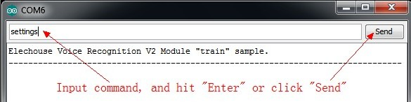
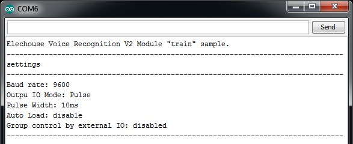
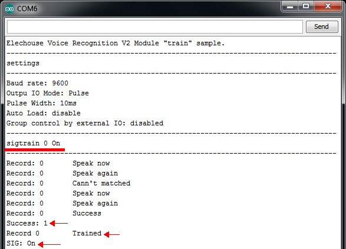
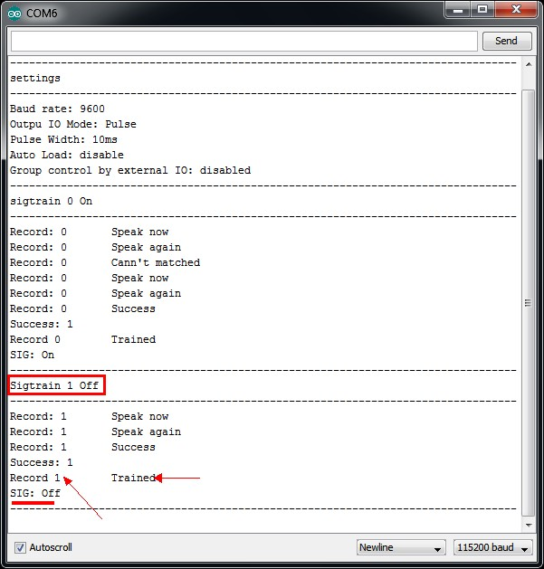
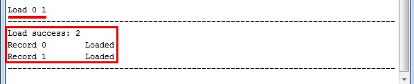
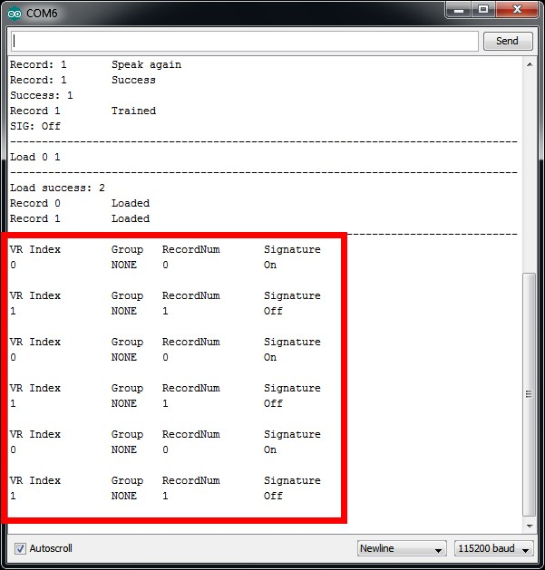
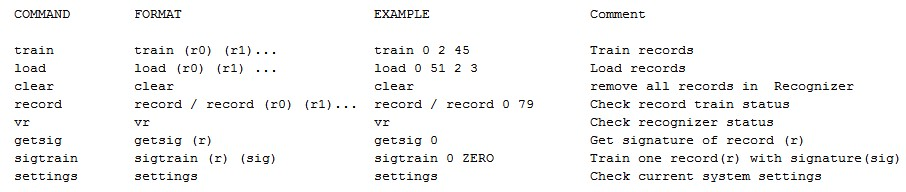
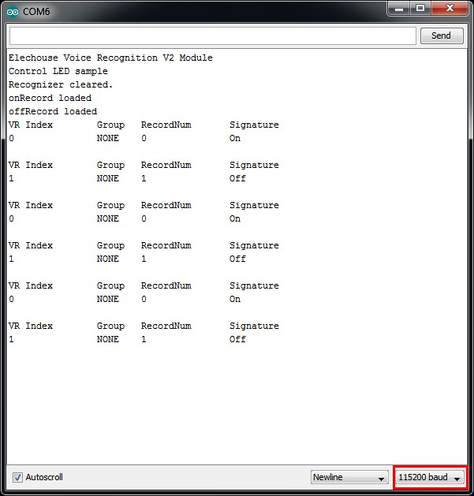

# Spraakherkenning V3

## Opmerking
Dit repository is een fork van [VoiceRecognitionV3](https://github.com/elechouse/VoiceRecognitionV3), specifiek aangepast voor **ESP32** microcontroller geprogrammeerd in **[PlatformIO IDE][PlatformIO]**. 

**Belangrijke verschillen van het origineel:**
- Ontwikkeld en getest op **ESP32** (geen Arduino UNO)
- Gebruikt **PlatformIO** voor project- en dependencybeheer
- Bevat meerdere PlatformIO-projectvoorbeelden in aparte mappen
- Seriële communicatie via UART2 (GPIO4/GPIO3) in plaats van SoftwareSerial
- Aangepast voor het ESP32-ecosysteem

De originele README is ter referentie behouden, maar raadpleeg deze pagina voor PlatformIO/ESP32-specifieke instructies.

## Kenmerken
- Herken maximaal 7 spraakopdrachten tegelijkertijd
- Sla maximaal 255 opnamen op
- Groepsbeheer en externe groepsselectiepin
- Automatisch laden van opnamen bij inschakelen
- Handtekeningfunctie, helpt bij het identificeren van spraakopnamen
- LED-indicatie

## Inleiding

## Terminologie
- **herkenner** -- kernonderdeel van de spraakherkenningsmodule
- **herkenner-index** -- Elke spraakherkenningsmodule ondersteunt 7 spraakopdrachten; de herkenner heeft 7 regio's voor elke spraakopdracht; één index komt overeen met één regio
- **trainen** -- laat de spraakherkenningsmodule uw spraakopdracht opnemen
- **laden** -- kopieer getrainde spraak naar de herkenner van de spraakherkenningsmodule
- **opname** -- de getrainde spraakopdracht opgeslagen in flash, genummerd van 0 tot 79
- **handtekening** -- alias voor **opname**
- **groep** -- helpt bij het beheren van opnamen; elke groep heeft 7 **opnamen**. Systeemgroep en gebruikersgroep worden ondersteund.

## Snelstartgids

### Voorbereiding
+ [Spraakherkenning V3][VRV3] module
+ [ESP32][ESP32] microcontroller bord
+ [PlatformIO IDE][PlatformIO] (of VS Code met PlatformIO extensie)
+ USB kabel voor verbinding met ESP32
+ [Access Port][accessport] (optioneel, voor seriële communicatie)

[idtrain]: #trainen
### Trainen
1. Verbind uw Spraakherkenning V3 module met ESP32, standaard:
   - VR RX → ESP32 GPIO 3 (TX2)
   - VR TX → ESP32 GPIO 4 (RX2)
   - VR GND → ESP32 GND
   - VR VCC → ESP32 5V

1. Clone of download deze repository naar uw lokale machine
1. Open het **vr_sample_train** project in PlatformIO
1. Configureer de seriële poort in `platformio.ini` als dat nodig is
1. Klik op **Build** om het project te compileren en **Upload** om naar de ESP32 te flashen
1. Open de **Seriële Monitor** in PlatformIO (Monitor knop). Stel baudrate in op 115200.

1. Stuur opdracht `settings` (onafhankelijk van hoofdletters) om spraakherkenningsmodule-instellingen te controleren. Voer `settings` in en druk `Enter` om te verzenden.  

1. Trainen spraakherkenningsmodule. Stuur `sigtrain 0 On` opdracht om opname 0 te trainen met handtekening "On". Wanneer Seriële Monitor "Speak now" afdrukt, moet u uw stem spreken (kan elk woord zijn, zinvol woord aanbevolen, kan hier 'On' zijn), en wanneer Seriële Monitor "Speak again" afdrukt, moet u uw stem herhalen. Als deze twee stemmen overeenkomen, drukt Seriële Monitor "Success" af en wordt "opname 0" getraind, of als deze niet overeenkomen, herhaal spreken totdat het succesvol is.  
**Tijdens het trainen kunnen de twee LED's op de spraakherkenningsmodule uw trainingsproces helpen. Na verzending van `train` opdracht, knippert SYS_LED wat aangeeft dat u klaar moet zijn, spreek dan uw stem zodra STATUS_LED brandt, de opname eindigt zodra STATUS_LED uit gaat. Dan knippert SYS_LED weer, deze status herhaald zich, wanneer het trainen succesvol is, knipperen SYS_LED en STATUS_LED samen, als trainen mislukt knipperen SYS_LED en STATUS_LED snel samen.**  
  

1. Trainen een ander opname. Stuur `sigtrain 1 Off` opdracht om opname 1 te trainen met handtekening "Off". Kies uw favoriete woorden om te trainen (het kan elk woord zijn, zinvol woord aanbevolen, kan hier 'Off' zijn).  

1. Stuur `load 0 1` opdracht om spraak te laden. En zeg uw woord om te zien of de spraakherkenningsmodule uw woorden kan herkennen.  

	Als de stem wordt herkend, kunt u zien.  
	
1. Trainen voltooid. Train voorbeeld ondersteunt ook verschillende andere opdrachten.  

### Toepassing
[controlled]: #led-voorbeeld-besturen
#### LED-voorbeeld besturen
1. Open het **vr_sample_control_led** project in PlatformIO
1. Verbind uw ESP32 met de computer via USB
1. Klik op **Build** om te compileren en **Upload** om naar ESP32 te flashen
1. Open de **Seriële Monitor** (Monitor knop in PlatformIO). Stel baudrate in op 115200.
1. Zeg uw getrainde stem om de LED op de ESP32 te besturen. Wanneer opname 0 wordt herkend, gaat de LED aan. Wanneer opname 1 wordt herkend, gaat de LED uit.  

1. LED-besturing voltooid.

## Projectstructuur
Deze repository bevat meerdere PlatformIO-projecten:
- **vr_sample_train** - Trainingsapplicatie voor het opnemen van spraakopdrachten
- **vr_sample_control_led** - Voorbeeld voor LED-besturing via spraakherkenning
- **vr_sample_bridge** - Bridge-applicatie voor directe communicatie met de module
- **vr_sample_multi_cmd** - Voorbeeld met meerdere spraakopdrachten
- **vr_sample_check_baud_rate** - Hulpapplicatie voor baudrate configuratie
### vr\_sample\_train
Zie [Trainen][idtrain] voor meer informatie.

### vr\_sample\_control\_led
Zie [LED besturen][controlled] voor meer informatie.

### vr_sample_bridge
Gebruik dit voorbeeld om de opdrachtset van de Spraakherkenningsmodule te kennen. Voor details, zie [Protocol][Protocol]. U hoeft alleen **Frame Command** en **Frame Data** in te voeren, niet **Frame Head**, **Frame Length**, **Frame End**.

Voor configuratie in PlatformIO:
1. Open het **vr_sample_bridge** project
2. Build en upload naar ESP32
3. Open PlatformIO Monitor en stel baudrate in op 115200

Voorbeeld van verzendingen:
- "01" - Herkenner controleren
- "31" - Herkenner wissen
- "30 00 02 04" - Opnamen 0, 2, 4 laden

### vr\_sample\_multi\_cmd
Dit voorbeeld toont hoe u meerdere opdrachten kunt gebruiken (Verbreek de limiet van 7 spraakopdrachten). Dit voorbeeld gebruikt **OPNAME 0** om tussen de 2 opdrachtgroepen te schakelen (niet spraakherkenningsgroepfunctie), eerste groep bestaat uit *opname 0, 1, 2, 3, 4, 5, 6,** en tweede groep bestaat uit **opname 0, 7, 8, 9, 10, 11, 12**.

***Opmerking: Voordat u dit voorbeeld start, moet u eerst uw spraakherkenningsmodule trainen, en zorg ervoor dat alle opnamen van 0 tot 12 zijn getraind.***

### vr_sample_check_baud_rate
Dit voorbeeld helpt u de baudrate van de Spraakherkenningsmodule te controleren als u uw aangepaste instellingen bent vergeten. Build, upload naar ESP32 en controleer de uitvoer in PlatformIO Monitor.

[Protocol]: #protocol
## Protocol
De eenvoudigste manier om met de Spraakherkennings V3 module te werken is het gebruik van deze VoiceRecognition bibliotheek. Voor verdere aanpassingen en directe communicatie, volgt hier het protocoldetails waarmee u rechtstreeks met de Spraakherkennings V3 module kunt communiceren via de seriële interface.

### Basisindeling

#### Controle
**| Head (0AAH) | Length | Command | Data | End (0AH) |**  
Length = L(Length + Command + Data)

#### Retournering
**| Head (0AAH) | Length | Command | Data | End (0AH) |**  
Length = L(Length + Command + Data)

OPMERKING: Gegevensgebied verschilt per opdracht.

### Code
[index]: #code
***ALLE CODE ZIJN IN HEXADECIMAAL FORMAAT***

---  
***FRAME CODE***  
**AA** --> Frame Head  
**0A** --> Frame End  

---
***CONTROLEREN***  
**00** --> [Systeeminstellingen controleren][id00]  
**01** --> [Herkenner controleren][id01]  
**02** --> [Trainingsstatus van opname controleren][id02]  
**03** --> [Handtekening van één opname controleren][id03]

---
***SYSTEEMINSTELLINGEN***  
**10** --> [Systeeminstellingen herstellen][id10]  
**11** --> [Baudrate instellen][id11]  
**12** --> [Output IO-modus instellen][id12]  
**13** --> [Output IO-pulsbreedteinstelling][id13]   
**14** --> [Output IO herstellen][id14]  
**15** --> [Auto-laden bij inschakelen instellen][id15]   

---
***OPNAMEBEWERKING***  
**20** --> [Één opname of opnamen trainen][id20]  
**21** --> [Één opname trainen en handtekening instellen][id21]  
**22** --> [Handtekening voor opname instellen][id22]  

---
***HERKENNERCONTROLE***  
**30** --> [Een opname of opnamen naar herkenner laden][id30]  
**31** --> [Herkenner wissen][id31]  
**32** --> [Groepsbeheer][id32]

---
***DEZE 3 OPDRACHTEN WORDEN ALLEEN GEBRUIKT VOOR RETOURBERICHTEN***  
**0A** --> [Prompt][id0a]  
**0D** --> [Spraak herkend][id0d]  
**FF** --> [Fout][idff]  

### Details

[id00]: #systeeminstellingen-controleren-00
#### Systeeminstellingen controleren (00)
Gebruik de opdracht "Systeeminstellingen controleren" om huidige instellingen van de spraakherkenningsmodule te controleren, inclusief seriële baudrate, output IO-modus, output IO-pulsbreedteinstelling, auto-laden en groepsfunctie.  
**Indeling:**  
| AA | 02 | 00 | 0A |  
**Retournering:**  
| AA | 08 | 00 | STA | BR | IOM | IOPW | AL | GRP | 0A |  
**STA** : Trainingsstatus (0-ongetraind 1-getraind FF-opname waarde buiten bereik)  
**BR**: Baudrate (0,3-9600 1-2400 2-4800 4-19200 5-38400)  
**IOM**: Output IO Mode (0-Pulse 1-Toggle 2-Clear 3-Set)  
**IOPW**: Output IO Pulsbreedteinstelling (Pulse Mode) (1~15)  
**AL**: Auto-laden bij inschakelen (0-uitgeschakeld 1-ingeschakeld)  
**GRP**: Groepsbeheer via externe IO (0-uitgeschakeld 1-systeemgroep 2-gebruikersgroep)

[Terug naar index][index]
[id01]: #herkenner-controleren-01
#### Herkenner controleren (01)
Gebruik de opdracht "Herkenner controleren" om **herkenner** van de spraakherkenningsmodule te controleren.  
**Indeling:**  
| AA | 02 | 01 | 0A |  
**Retournering:**  
| AA | 0D | 01 | RVN | VRI0 | VRI1 | VRI2 | VRI3 | VRI4 | VRI5 | VRI6 | RTN | VRMAP | GRPM | 0A |  
**RVN**: aantal geldige opnamen in herkenner. (MAX 7)  
**VRIn**(n=0~6): Opname die zich in herkenner bevindt; n is waarde van herkenner-index  
**RTN**: aantal totale opnamen in herkenner.  
**VRMAP**: geldige opnamebitmap voor VRI0~VRI6.  
**GRPM**: groepsmodus-indicator. (FF-niet in groepsmodus 00~0A-systeemgroep 80~87-gebruikersgroepsmodus)  

[Terug naar index][index]
[id02]: #trainingsstatus-van-opname-controleren-02
#### Trainingsstatus van opname controleren (02)
Gebruik de opdracht "Trainingsstatus van opname controleren" om te controleren of de opname is getraind.  
**Indeling:**  
*Alle opnamen controleren*  
| AA | 03 | 02 | FF | 0A |  
*Specifieke opnamen controleren*  
| AA | 03+n | 02 | R0 | ... | Rn | 0A |  
**Retournering:**  
| AA | 5+2*n | 02 | N | R0 | STA | ... | Rn | STA | 0A |  
**N**: aantal getrainde opnamen.  
**R0 ~ Rn**: opname.  
**STA** : trainingsstatus (0-ongetraind 1-getraind FF-opname waarde buiten bereik)  

[Terug naar index][index]
[id03]: #handtekening-van-één-opname-controleren-03
#### Handtekening van één opname controleren (03)
Gebruik deze opdracht om de handtekening van één opname te controleren.  
**Indeling:**  
| AA | 03 | 03 | Record | 0A |  
**Retournering:**  
| AA | 03 | 03 | Record | SIGLEN | SIGNATURE | 0A |  
**SIGLEN**: lengte van handtekeningsstring  
**SIGNATURE**: handtekeningsstring

[Terug naar index][index]
[id10]: #systeeminstellingen-herstellen-10
#### Systeeminstellingen herstellen (10)
Gebruik deze opdracht om instellingen van de spraakherkenningsmodule naar standaard te herstellen.  
**Indeling:**  
| AA | 02 | 10 | 0A |  
**Retournering:**  
| AA | 03 | 10 | 00 | 0A |  

[Terug naar index][index]
[id11]: #baudrate-instellen-11
#### Baudrate instellen (11)
Gebruik deze opdracht om baudrate van de spraakherkenningsmodule in te stellen; werkt na herstart van de spraakherkenningsmodule.  
**Indeling:**  
| AA | 03 | 11 | BR | 0A |  
**Retournering:**  
| AA | 03 | 11 | 00 | 0A |  
**BR**: Seriële baudrate. (0-9600 1-2400 2-4800 3-9600 4-19200 5-38400)  

[Terug naar index][index]
[id12]: #output-io-modus-instellen-12
#### Output IO-modus instellen (12)
Gebruik deze opdracht om output IO-modus van de spraakherkenningsmodule in te stellen; werkt onmiddellijk na uitvoering van de instructie.  
**Indeling:**  
| AA | 03 | 12 | MODE | 0A |  
**Retournering:**  
| AA | 03 | 12 | 00 | 0A |  
**MODE**: Output IO-modus. (0-pulsmode 1-Toggle 2-Set 3-Clear)  

[Terug naar index][index]
[id13]: #output-io-pulsbreedteinstelling-13
#### Output IO-pulsbreedteinstelling (13)
Gebruik deze opdracht om output IO-pulsbreedteinstelling van de spraakherkenningsmodule in te stellen; werkt onmiddellijk na uitvoering van de instructie. Pulsbreedteinstelling wordt gebruikt wanneer output IO-modus is **"Pulse"**.  
**Indeling:**  
| AA | 03 | 13 | LEVEL | 0A |  
**Retournering:**  
| AA | 03 | 13 | 00 | 0A |  
**LEVEL**: pulsbreedteniveau. Details:

	- 00            10ms
	- 01 	 		15ms
	- 02 	 		20ms
	- 03 	 		25ms
	- 04 	 		30ms
	- 05 	 		35ms
	- 06 	 		40ms
	- 07 	 		45ms
	- 08 	 		50ms
	- 09 	 		75ms
	- 0A 	 		100ms
	- 0B 	 		200ms
	- 0C 	 		300ms
	- 0D 	 		400ms
	- 0E 	 		500ms
	- 0F            1s

[Terug naar index][index]
[id14]: #output-io-herstellen-14
#### Output IO herstellen (14)
Gebruik deze opdracht om output IO te herstellen. Deze opdracht kan worden gebruikt in output IO set/clear-modus om een door gebruiker gedefinieerde puls te genereren.  
**Indeling:**  
| AA | 03 | 14 | FF | 0A |  (alle output io herstellen)  
| AA | 03+n | 14 | IO0 | ... | IOn | 0A |  (output ios herstellen)  
**Retournering:**  
| AA | 03 | 14 | 00 | 0A |  
**IOn**: nummer van output io  

[Terug naar index][index]
[id15]: #auto-laden-bij-inschakelen-instellen-15
#### Auto-laden bij inschakelen instellen (15)
Gebruik deze opdracht om "Auto-laden bij inschakelen" functie in te schakelen of uit te schakelen.  
**Indeling:**  
| AA | 03 | 15 | 00 | 0A |  (auto-laden uitschakelen)  
| AA | 03+n | 15 | BITMAP | R0 | ... | Rn | 0A | (auto-laden instellen)  
**Retournering:**  
| AA | 04+n | 15 | 00 | BITMAP | R0 | ... | Rn | 0A | (auto-laden instellen retournering)  
**BITMAP**: Opname-bitmap. ( **0**-nul opname, auto-laden uitschakelen **01**-één opname **03**-twee opnamen **07**-drie opnamen **0F**-vier opnamen **1F**-vijf opnamen **3F**-zes opnamen **7F**-zeven opnamen)  
**R0~Rn**: Opname  

[Terug naar index][index]
[id20]: #één-opname-of-opnamen-trainen-20
#### Één opname of opnamen trainen (20)
Train opnamen; kunt verschillende opnamen tegelijk trainen.  
**Indeling:**  
| AA | 03+n | 20 | R0 | ... | Rn | 0A |   
**Retournering:**  
| AA | LEN | 0A | RECORD | PROMPT | 0A |  
| AA | 05+2*n | 20 | N | R0 | STA0 | ... | Rn | STAn | SIG | 0A |  
**SIG**: handtekeningsstring  
**PROMPT**: prompt-string  
**Rn**: Opname  
**STA**: trainingsresultaat (0-Succes 1-Timeout 2-Opname waarde buiten bereik)  
**N**: aantal succesvol getrainde  

[Terug naar index][index]
[id21]: #één-opname-trainen-en-handtekening-instellen-21
#### Één opname trainen en handtekening instellen (21)
Train één opname en stel een handtekening ervoor in; één opname tegelijk.  
**Indeling:**  
| AA | 03+SIGLEN | 21 | RECORD | SIG | 0A |  (Handtekening instellen)  
**Retournering:**  
| AA | LEN | 0A | RECORD | PROMPT | 0A |  (trainings prompt)  
| AA | 05+SIGLEN | 21 | N | RECORD | STA | SIG | 0A |  
**SIG**: handtekeningsstring  
**PROMPT**: prompt-string  
**STA**: trainingsresultaat (0-Succes 1-Timeout 2-Opname waarde buiten bereik)  
**N**: aantal succesvol getrainde  

[Terug naar index][index]
[id22]: #handtekening-voor-opname-instellen-22
#### Handtekening voor opname instellen (22)
Stel een handtekening in voor een opname; één opname tegelijk.  
**Indeling:**  
| AA | 03+SIGLEN | 22 | RECORD | SIG | 0A |  (Handtekening instellen)  
| AA | 03 | 22 | RECORD | 0A |  (Handtekening verwijderen)  
**Retournering:**  
| AA | 04+SIGLEN | 22 | 00 | RECORD | SIG | 0A |  (Handtekening instellen retournering)  
| AA | 04 | 22 | 00 | RECORD | 0A |  (Handtekening verwijderen retournering)  
**SIG**: handtekeningsstring  
**SIGLEN**: lengte van handtekeningsstring  

[Terug naar index][index]
[id30]: #een-opname-of-opnamen-naar-herkenner-laden-30
#### Een opname of opnamen naar herkenner laden (30)
Laad opnamen (1~7) naar herkenner van de spraakherkenningsmodule; na uitvoering start de spraakherkenningsmodule onmiddellijk met herkennen.  
**Indeling:**  
| AA | 2+n | 30 | R0 | ... | Rn | 0A |  
**Retournering:**  
| AA | 2+n | 30 | N | R0 | STA0 | ... | Rn | STAn | 0A |  
N: aantal succesvol geladen
R0~Rn: Opname
STA0~STAn: Laadresultaat. (**0**-Succes **FF**-Opname waarde buiten bereik **FE**-Opname ongetraind **FD**-Herkenner vol **FC**-Opname al in herkenner)

[Terug naar index][index]
[id31]: #herkenner-wissen-31
#### Herkenner wissen (31)
Stop met herkennen en maak herkenner van spraakherkenningsmodule leeg.
**Indeling:**  
| AA | 02 | 31 | 0A |  
**Retournering:**  
| AA | 03 | 31 | 00 | 0A |  

[Terug naar index][index]
[id32]: #groepsbeheer-32
#### Groepsbeheer (32)
##### Groepsselectie  
Stel groepsbeheermodus in (uitschakelen, systeem, gebruiker); als groepsbeheerfunctie is ingeschakeld (systeem of gebruiker), wordt de spraakherkenningsmodule beheerd door de externe besturings-IO.   
**Indeling:**  
| AA | 04 | 32 | 00 | MODE | 0A |  
**MODE**: nieuwe groepsbeheermodus. (00-uitschakelen 01-systeem 02-gebruiker FF-controleren)  
**Retournering:**  
| AA | 03 | 32 | 00 | 0A |  
of  
| AA | 05 | 32 | 00 | FF | MODE | 0A | (controleprogramma retournering)  

##### Gebruikersgroep instellen
Stel inhoud van gebruikersgroep in (opname).  
**Indeling:**  
| AA | 03 | 32 | 01 | UGRP | 0A |  (UGRP verwijderen)  
| AA | LEN | 32 | 01 | UGRP | R0 | ... | Rn | 0A |  (UGRP instellen)  
**UGRP**: gebruikersgroepnummer  
**R0~Rn**: opname-indexnummer (n=0,1,...,6)  
**Retournering:**  
| AA | 03 | 32 | 00 | 0A |  (Succesvolle retournering)

##### Systeemgroep laden
Laad systeemgroep naar herkenner; deze opdracht wist herkenner.  
**Indeling:**  
| AA | 04 | 32 | 02 | SGRP | 0A |  
**Retournering:**  
| AA | 04 | 32 | SGRP | VRI0 | VRI1 | VRI2 | VRI3 | VRI4 | VRI5 | VRI6 | RTN | VRMAP | GRPM | 0A |  
**SGRP**: Systeemgroepnummer.  
**VRIn**(n=0~6): Opname die zich in herkenner bevindt; n is waarde van herkenner-index  
**RTN**: aantal totale opnamen in herkenner.  
**VRMAP**: geldige opnamebitmap voor VRI0~VRI6.  
**GRPM**: groepsmodus-indicator. (00~0A-systeemgroep)  

##### Gebruikersgroep laden
Laad gebruikersgroep naar herkenner; deze opdracht wist herkenner.  
**Indeling:**  
| AA | 04 | 32 | 03 | UGRP | 0A |  
**Retournering:**  
| AA | 04 | 32 | UGRP | VRI0 | VRI1 | VRI2 | VRI3 | VRI4 | VRI5 | VRI6 | RTN | VRMAP | GRPM | 0A |  
**UGRP**: Systeemgroepnummer.  
**VRIn**(n=0~6): Opname die zich in herkenner bevindt; n is waarde van herkenner-index  
**RTN**: aantal totale opnamen in herkenner.  
**VRMAP**: geldige opnamebitmap voor VRI0~VRI6.  
**GRPM**: groepsmodus-indicator. (00~0A-systeemgroep)  
##### Gebruikersgroep controleren
Controleer inhoud van gebruikersgroep.  
**Indeling:**  
| AA | 04 | 32 | 04 | 0A | (alle gebruikersgroepen controleren)  
of  
| AA | 04 | 32 | 04 | UGRP0 | ... | UGRPn | 0A | (gebruikersgroep controleren)  
**Retournering:**  
| AA | 0A | 32 | UGRP | R0 | R1 | R2 | R3 | R4 | R5 | R6 | 0A |  
**UGRP**: Gebruikersgroepnummer.  
**R0~R6**: Elke opname.  

[Terug naar index][index]
[id0a]: #prompt-0a
#### Prompt (0A)
**Prompt** opdracht wordt alleen gebruikt voor spraakherkenningsmodule om gegevens terug te geven wanneer gebruiker spreekcommando traint.   
**Indeling:**  
GEEN  
**Retournering:**  
| AA | 07 | 0A | RECORD | PROMPT | 0A |  
**RECORD**: opname die wordt getraind  
**PROMPT**: prompt-string  

[Terug naar index][index]
[id0d]: #spraak-herkend-0d
#### Spraak herkend (0D)
**Spraak herkend** opdracht wordt alleen gebruikt voor spraakherkenningsmodule om gegevens terug te geven wanneer spraak wordt herkend.  
**Indeling:**  
GEEN  
**Retournering:**  
| AA | 07 | 0D | 00 | GRPM | R | RI | SIGLEN | SIG | 0A |  
**GRPM**: groepsmodus-indicator. (FF-niet in groepsmodus 00~0A-systeemgroepsmodus 80~87-gebruikersgroepsmodus)  
**R**: opname die wordt herkend.  
**RI**: herkenner-indexwaarde voor herkende opname.  
**SIGLEN**: lengte van handtekening van herkende opname; 0 betekent geen handtekening; geen SIG-gebied  
**SIG**: inhoud van handtekening

[Terug naar index][index]
[idff]: #fout-ff
#### Fout (FF)
Fout opdracht wordt alleen gebruikt voor spraakherkenningsmodule om foutstatus terug te geven.  
**Indeling:**  
GEEN  
**Retournering:**  
| AA | 03 | FF | ECODE | 0A |  

**ECODE**: foutcode (FF-opdracht ongedefinieerd FE-opdrachtlengtefout FD-gegevensfout FC-subopdracht fout FB-opdrachtgebruiksfout)

[Terug naar index][index]

## Bibliotheekverwijzing
Zie `VoiceRecognitionV3.cpp` of [libref.pdf][libref] voor meer informatie.

## Kopen ##
[![elechouse][EHICON]][EHLINK]

[Top][START]

[EHLINK]: http://www.elechouse.com

[EHICON]: https://raw.github.com/elechouse/CarDriverShield/master/image/elechouse.png

[accessport]: http://www.sudt.com/en/ap/       "AccessPort"

[PlatformIO]: https://platformio.org/ "PlatformIO IDE"

[ESP32]: https://www.espressif.com/en/products/socs/esp32 "ESP32 Microcontroller"

[VRV3]: http://www.elechouse.com/elechouse/index.php?main_page=product_info&cPath=&products_id=2254

[libref]: https://github.com/elechouse/VoiceRecognitionV3/blob/master/libref.pdf?raw=true

